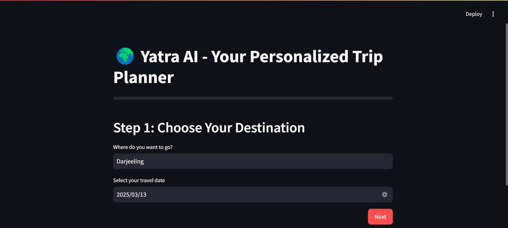
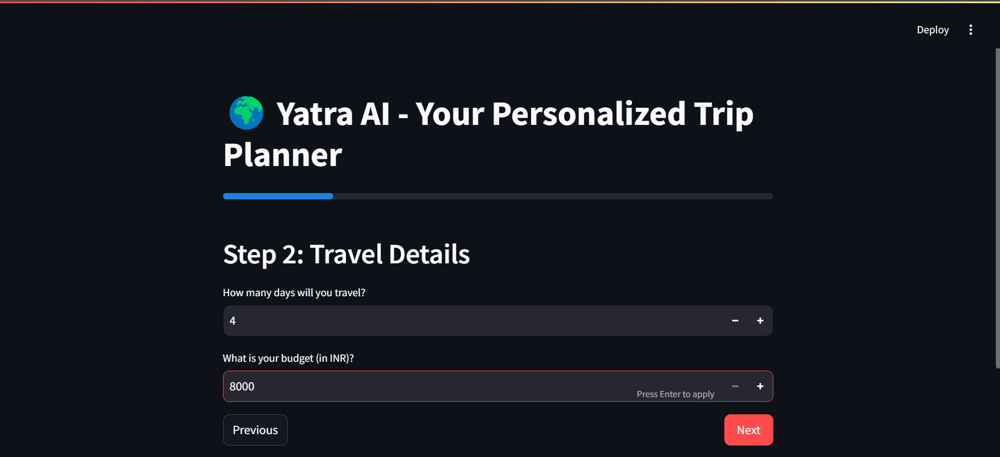
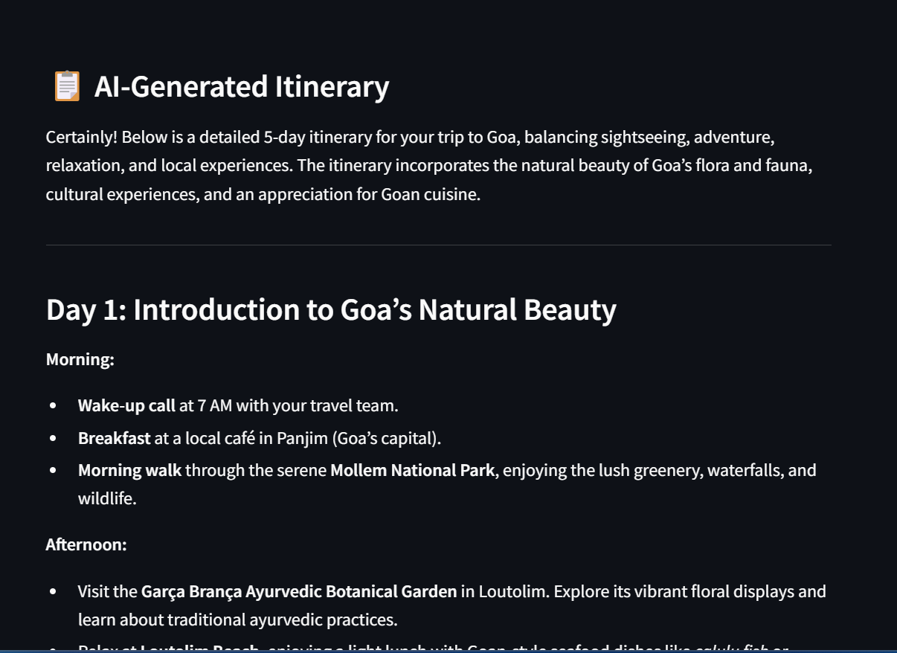
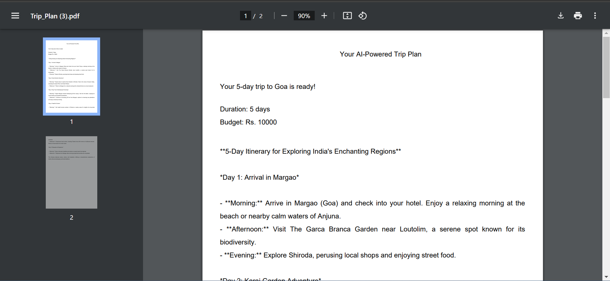
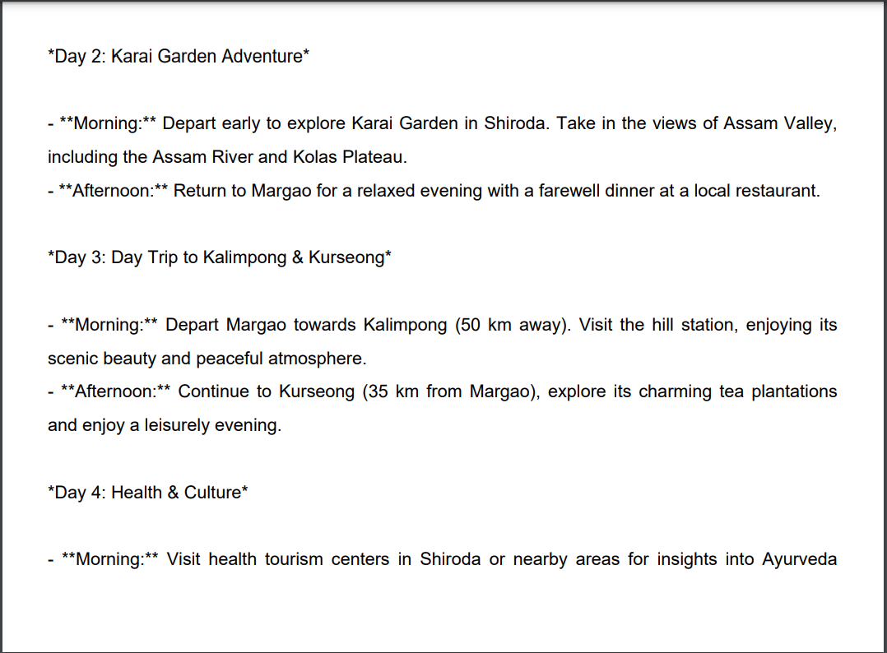

# Yaatra AI Trip Planner

Yaatra AI is an AI-powered trip planner that generates personalized travel itineraries based on user preferences such as destination, budget, trip duration, and activities. It uses **ChromaDB** for vector-based retrieval, **multi-chain RAG architecture**, and AI models for itinerary generation.

## 🚀 Features

- **Multi-step user input process** to generate a trip plan dynamically.
- **AI-generated trip itinerary** using Llama models from ChatGroq.
- **ChromaDB for efficient data retrieval** and semantic search.
- **Multi-chain RAG architecture** for modular trip generation.
- **Cost optimization chain** to ensure the trip fits within the budget.
- **API-based data retrieval** for top destinations and attractions.
- **PDF download option** for saving the generated trip plan.

---

## 🎥 Demo: How Yaatra AI Works

Below is a step-by-step guide on how Yaatra AI generates a personalized trip plan using AI.

### 1️⃣ **User Input Stage**  
The user provides the trip details, including the **destination, budget, duration, trip type, and activities**.  

  

Users can further refine their choices to ensure the AI generates a tailored itinerary.

  

---

### 2️⃣ **AI Processing & Trip Plan Generation**  
Once the user submits their preferences, Yaatra AI processes the data and retrieves relevant travel information using **ChromaDB and multi-chain RAG architecture**.  

The AI model generates a **personalized itinerary, estimated costs, and optimized travel plans**.

  

After processing, the app dynamically updates and presents a **structured trip plan**.

  

---

### 3️⃣ **Downloading the Trip Plan as a PDF**  
Users can download the AI-generated itinerary in **PDF format** for offline access.  

Clicking the **"Download Trip PDF"** button generates a structured travel document.

  

The downloaded PDF contains **all trip details, cost breakdown, and AI recommendations**.

  

---

### ✅ **Final Output**  
Yaatra AI provides a **well-structured trip itinerary** optimized for the user's preferences and budget. The system ensures that all aspects of the trip—including accommodation, transport, and activities—are planned efficiently.

This **intelligent travel planner** allows users to **save time, reduce planning effort, and get AI-powered recommendations**.

---

## 🛠 Tech Stack

Yaatra AI is built using a combination of **cutting-edge AI models, databases, and frameworks** to provide a seamless trip-planning experience.

### ⚡ **Core Technologies**
| Technology           | Description                                                         |
|----------------------|---------------------------------------------------------------------|
| **Streamlit**        | Frontend framework for building an interactive UI.                  |
| **LangChain**        | Framework for orchestrating LLM-based AI workflows.                 |
| **Ollama**           | Runs AI models locally for text generation and embeddings.          |
| **ChromaDB**         | Vector database for semantic search and AI-driven recommendations.  |
| **DeepSeek-R1:1.5B** | AI model used for generating trip itineraries.                      |
| **nomic-embed-text** | Embedding model for text-based similarity searches.                 |
| **Python**           | Main programming language for backend logic and AI processing.      |
|----------------------|---------------------------------------------------------------------|

---

### 🏗 **System Architecture**
The system follows a **modular approach** using the following key components:

1. **User Input Handling** → Collects user preferences and trip details via Streamlit UI.
2. **ChromaDB Retrieval** → Stores & fetches vectorized travel data for AI-based recommendations.
3. **Multi-Chain RAG Processing** →  
   - **Itinerary Chain**: Generates a structured trip plan.  
   - **Cost Optimization Chain**: Ensures the trip stays within budget.  
4. **AI-Powered Trip Generation** → Uses **deepseek-r1:1.5b** for itinerary suggestions.
5. **PDF Generation** → Formats and allows users to download their trip plan.

This **end-to-end AI pipeline** ensures that **real-time, dynamic, and cost-efficient** trip plans are generated seamlessly.

---

## 📁 Project Structure

```
yaatra-ai-trip-planner/
│── chromadb/
│    ├── chroma.sqlite3                 # ChromaDB database storing vector embeddings
│
│── data/
│    ├── __init__.py
│    ├── destination_data_extractor.py  # Extracts and processes destination data
│    ├── destination_data.json          # Stored travel data for trip generation
│    ├── destination_data.txt           # Raw text data for processing
│
│── images/                             # Input/output screenshots of the app
│
│── src/
│    │── __init__.py
│    │── chromaDB/
│    │    ├── __init__.py
│    │    ├── chroma_chunks.py          # Handles chunking and embedding storage
│    │── RAG_chains/
│    │    ├── __init__.py
│    │    ├── itinerary_chain.py        # Generates itinerary based on user input
│
│── utils/
│    ├── __init__.py
│    ├── download_trip.py               # Generates and downloads trip PDF
│    ├── trip_data.py                   # Processes and formats trip data
│
│── app.py                              # Main Streamlit application
│── requirements.txt                    # Dependencies
│── README.md                           # Project Documentation
```

---

## ⚙️ Setup Instructions

### 1️⃣ Clone the Repository

```bash
git clone https://github.com/your-repo/yaatra-ai-trip-planner.git
cd yaatra-ai-trip-planner
```

### 2️⃣ Install Dependencies

```bash
pip install -r requirements.txt
```

### 3️⃣ Start ChromaDB

Ensure ChromaDB is running:

```bash
python -m chromadb
```

### 4️⃣ Download Required AI Models

```bash
ollama pull nomic-embed-text  # For embedding text data
ollama run deepseek-r1:1.5b   # For AI-generated trip recommendations
```

### 5️⃣ Run the App

```bash
streamlit run app.py
```

---

## 🧠 How It Works

### 🔹 AI-Driven Trip Planning

1. **User Input Collection**: Users enter their destination, budget, travel dates, and trip type. Inputs are stored in session state for dynamic updates.

2. **AI-Powered Recommendations**: The app retrieves relevant travel data using an API endpoint and generates an itinerary.
   - The app retrieves relevant travel data using an API endpoint.
   - Itinerary generation is done using a **multi-chain RAG** approach:
     - **Itinerary Chain**: Plans the day-wise schedule.

3. **PDF Generation & Download**:  
   - Users can download their AI-generated trip plan as a **PDF file**.
   - The `download_trip.py` module formats the data and saves it as a PDF.

---

## 🔗 Future Improvements

- **Integrating real-time flight & hotel data** from external APIs.
- **Adding user authentication** to save and access past trips.
- **Improving itinerary personalization** using advanced AI models.

---

## 📝 License

This project is licensed under the MIT License.

---

## 💬 Contact & Contributions

🚀 **Have feedback or want to contribute?** Feel free to open an issue or submit a pull request on GitHub. Your contributions are always welcome!  

💡 **Suggest Features & Report Issues:** If you have ideas for new features or encounter any issues, please **raise an issue** on the GitHub repository. Your feedback helps make Yaatra AI even better!  

📧 **Contact:** [Gaurav Kumar Singh](mailto:gauravsingh96753@gmail.com)  
🔗 **GitHub:** [Gaurav-576](https://github.com/Gaurav-576)  
🌐 **Portfolio:** [My Website](https://my-portfolio-website-gaurav.streamlit.app)  
🔗 **LinkedIn:** [Gaurav Singh](https://www.linkedin.com/in/gaurav-singh-mlops)  

---

## ⭐ Support & Acknowledgments  

If you found **Yaatra AI** useful, please **⭐ star this repository** on GitHub! Your support helps in improving and adding new features.  

💡 **Special thanks to the Open-Source Community** for providing the tools and resources that power this project! 🚀✨  

_“Travel far enough, you meet yourself.” — David Mitchell_  

